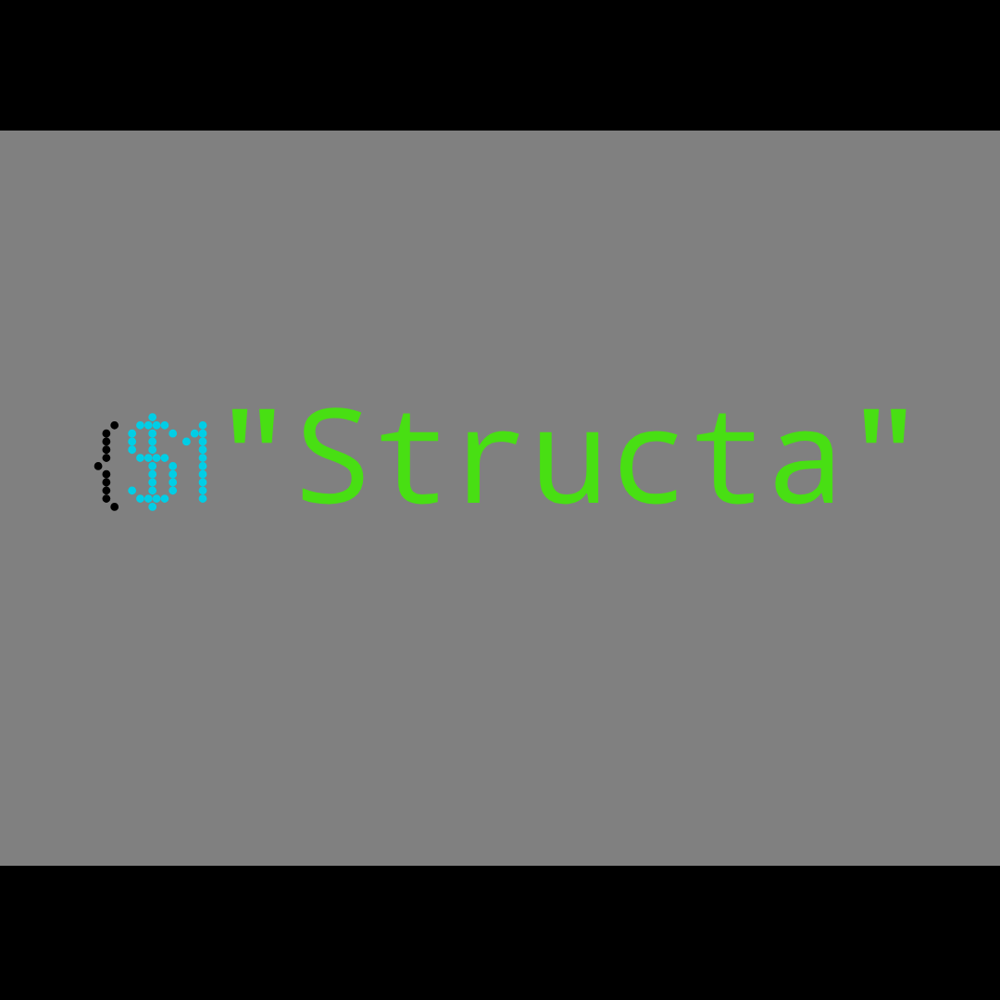

# Structa
**Structa is a relatively simple "language" for quick, static websites.**
The Structa interpreter also includes a web server with automatic routing.
Examples are given in the `/examples` folder. I will not include a guide to the syntax.

 

## Usage
**First, git clone** `https://github.io/ETAModder/structa.git` **and cd into it.**
After that, you will want to make an `index.stc` file with your Structa code in it.
You can also have multiple files and directories in the `/pages` dir, but going directly
to the domain you are running the server on with no extension will default to `/pages/index.stc`
Once you've made your Structa files, you can use NodeJS to run the interpreter.
Doing `node index.js` in your shell of choice should work, and you will be able to access
the page(s) on localhost:8080
